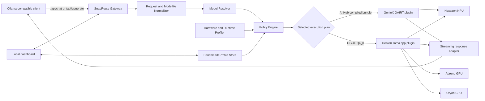
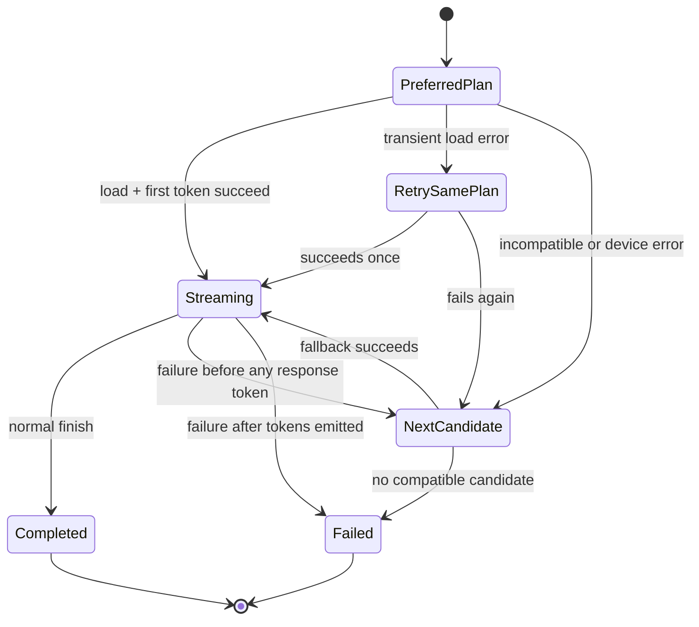

# SnapRoute

## An Ollama-compatible, energy-aware local AI gateway for Snapdragon PCs

**Document status:** Hackathon solution design  
**Target platform:** Windows 11 on Snapdragon X / X Elite / X2-class HP PCs  
**Primary runtime:** Qualcomm GenieX with QAIRT and `llama.cpp` plugins  
**Reference model:** Qwen3-4B-Instruct-2507, AI Hub QAIRT bundle on Hexagon NPU; use W4A16 when confirmed by the downloaded bundle manifest  
**Fallback model:** Same model family in GGUF Q4_0 through GenieX `llama_cpp`  
**Last validated:** 8 September 2026

---

## 1. Executive summary

Snapdragon AI PCs contain a Hexagon NPU designed for efficient on-device AI, yet a large part of the local-AI ecosystem is built around Ollama and its local API. On Windows, Ollama officially documents NVIDIA and AMD acceleration, while Qualcomm NPU support remains an open feature request. As a result, a Snapdragon-PC user can install a familiar local-AI application and still fail to benefit from the hardware that makes the machine an AI PC.

The original idea—create a runtime that makes GGUF models run on the Snapdragon NPU—was valid earlier, but it is no longer sufficiently novel by itself. Qualcomm now publishes **GenieX**, a runtime that can run GGUF models through `llama.cpp` on Snapdragon CPU/GPU/NPU and precompiled AI Hub bundles through QAIRT on the NPU. GenieX also includes an OpenAI-compatible server.

The remaining product gap is migration, compatibility, and intelligent selection. Existing Ollama clients expect Ollama endpoints at `/api/chat`, `/api/generate`, and `/api/tags`; users have Ollama names and Modelfiles; and a model that technically runs on an accelerator is not automatically the best choice for every context, precision, memory state, or battery condition.

**SnapRoute solves that gap.** It is a loopback-only local gateway that:

1. accepts the most important Ollama API calls without requiring client rewrites;
2. imports the useful parts of Ollama Modelfiles and maps Ollama model names to accelerated equivalents;
3. discovers the available Snapdragon CPU, Adreno GPU, Hexagon NPU, drivers, memory, and runtime capabilities;
4. selects a compatible model/runtime/compute-unit combination using measured device-specific profiles;
5. runs inference through Qualcomm GenieX;
6. falls back safely when an NPU path is incompatible or fails; and
7. shows the user exactly where inference ran and why, including latency, throughput, memory, and an energy-efficiency estimate.

The result is an **Ollama-shaped front door for Snapdragon-optimized local AI**, not a competing inference engine or a superficial chat interface.

### Core hypothesis

> On a supported Snapdragon HP PC, SnapRoute can preserve an Ollama-compatible application workflow while selecting a verified GenieX execution plan that reduces CPU contention and improves at least one latency/throughput metric and one efficiency/responsiveness metric versus the user's observed Ollama baseline, without an unacceptable task-quality loss.

This is a hypothesis to measure on the competition device, not a result to claim in advance.

---

## 2. Correct technical framing

### 2.1 What remains true

- Ollama applications and integrations commonly use its stable local HTTP API at `http://localhost:11434/api`.
- Ollama's Windows documentation lists NVIDIA and AMD acceleration paths, but does not list Qualcomm Hexagon NPU or Adreno acceleration as a supported Windows path.
- The Ollama repository still has an open request for Snapdragon X Elite NPU/GPU support.
- Running an LLM predominantly on the CPU can increase CPU occupancy, compete with foreground applications, and generally provide a worse performance-per-watt profile than a suitable accelerator path.
- Model format, quantization, runtime, chipset, context length, drivers, and available memory all affect whether a model can use the NPU.

### 2.2 What is now outdated

The statement “GGUF cannot run on the Qualcomm NPU and must always be converted to ONNX/QNN” is no longer accurate.

Current Qualcomm and `llama.cpp` documentation describes two Snapdragon paths:

| Model path | Runtime | Format | Compute options |
|---|---|---|---|
| Community model | GenieX `llama_cpp` plugin | GGUF | Hexagon NPU, Adreno GPU, CPU, or hybrid |
| Qualcomm-optimized model | GenieX `qairt` plugin | AI Hub/QAIRT compiled `.bin` bundle | Hexagon NPU |

For GGUF, Q4_0 is the recommended precision for the Hexagon path. Other quantizations may run on GPU/CPU or partially fall back. For QAIRT bundles, W4A16 is a common NPU-oriented precision baked into the model at compilation time. SnapRoute must read the actual bundle metadata rather than infer precision from the model name.

Therefore, the strongest and most honest problem statement is:

> Snapdragon users can run accelerated local models, but the familiar Ollama ecosystem and the Qualcomm acceleration ecosystem do not offer a seamless, transparent migration path. Users must understand model formats, quantization, runtimes, drivers, device selection, and API differences—and may not know whether the NPU is actually being used.

### 2.3 Why this is still worth solving after GenieX

GenieX handles inference. SnapRoute handles the product-level adoption problem around it:

- Ollama API compatibility rather than only OpenAI API compatibility;
- Ollama name and Modelfile migration;
- equivalent-model resolution between community GGUF and AI Hub bundles;
- device validation and actionable diagnostics;
- workload- and battery-aware routing instead of a fixed default;
- automatic fallback and recovery;
- comparable, user-visible efficiency evidence.

SnapRoute is intentionally designed **on top of** GenieX. Reimplementing Qualcomm's runtime would increase risk and reduce the amount of polished user value deliverable during the hackathon.

---

## 3. Target users and use cases

### Primary persona: local-AI user

A developer or student owns a Snapdragon Windows laptop and uses tools such as an Ollama-compatible chat UI, coding assistant, note tool, or RAG application. They want private offline inference, but do not know which runtime, precision, or device to choose.

**Job to be done:** “Let my existing local-AI client use my Snapdragon hardware efficiently without making me become a Qualcomm runtime expert.”

### Secondary persona: application developer

A developer has an existing Ollama integration and wants Snapdragon acceleration without maintaining a separate Qualcomm-specific code path.

**Job to be done:** “Keep my current request schema and point it at a local accelerated endpoint.”

### Demonstration use case

Local document summarization is ideal for the prototype:

- sensitive material justifies fully local processing;
- long prompts expose prefill performance and memory pressure;
- the output is easy for judges to assess;
- a repeatable workload makes CPU versus accelerated comparisons credible.

---

## 4. Product goals and boundaries

### Goals

- Make one useful Ollama-based workflow operate through Snapdragon acceleration with no client-code changes beyond the base URL, or no changes when SnapRoute owns port 11434.
- Support a verified Qualcomm AI Hub model on a Snapdragon HP PC.
- Produce clear evidence of the active backend and measured performance.
- Select a compatible path automatically and explain the decision.
- Continue serving requests through a fallback when acceleration is unavailable.
- Keep all inference and telemetry local by default.

### Non-goals for the hackathon

- Reimplement Ollama, `llama.cpp`, QNN, QAIRT, or GenieX.
- Convert arbitrary models into QAIRT bundles on the laptop.
- Promise that every Ollama model can run on the NPU.
- Support the entire Ollama API in the first prototype.
- Claim laboratory-grade power measurement from software-only telemetry.
- Train a new foundation model.

These boundaries turn a broad runtime project into a credible prototype.

---

## 5. Solution overview



### Product modes

| Mode | User intent | Routing emphasis |
|---|---|---|
| Eco | Maximize battery life and reduce foreground CPU contention | Prefer validated NPU plan; smaller model if necessary |
| Balanced | Good responsiveness with efficient execution | Minimize combined latency/energy score |
| Turbo | Fastest measured response while respecting memory/thermal limits | Choose best measured throughput/TTFT path |
| Manual | Reproducibility and developer control | Pin exact model, runtime, precision, and compute unit |

---

## 6. Detailed architecture

### 6.1 Ollama Compatibility Gateway

The gateway is a local HTTP service. It binds to `127.0.0.1` only.

Supported in the MVP:

| Ollama endpoint | SnapRoute behavior |
|---|---|
| `POST /api/chat` | Translate messages/options, stream Ollama-compatible NDJSON chunks |
| `POST /api/generate` | Translate raw prompt/system/options and stream response chunks |
| `GET /api/tags` | List SnapRoute aliases and resolved local model variants |
| `GET /api/ps` | Report the loaded model, runtime, compute unit, context, and memory |
| `POST /api/show` | Return imported metadata, capabilities, and active mapping |
| `GET /api/version` | Return SnapRoute version and compatibility declaration |

Stretch endpoints:

- `POST /api/pull`: resolve and download an AI Hub or Hugging Face variant;
- `POST /api/create`: create a SnapRoute alias from a supported Modelfile subset;
- `POST /api/embed`: route to an NPU-compatible embedding model;
- delete/copy endpoints for model lifecycle parity.

The service should use port **11435** during development to avoid colliding with Ollama. A user can stop Ollama and run `snaproute serve --port 11434` for transparent compatibility.

Compatibility has three explicit levels:

- **Contract-tested:** endpoint, streaming format, defaults, errors, and timing fields pass recorded Ollama API fixtures.
- **Best-effort:** the endpoint works for the documented subset but some optional fields are not available from GenieX.
- **Unsupported:** SnapRoute returns a clear error instead of silently changing semantics.

The dashboard and `/api/version` report the current compatibility level; the product must not claim complete Ollama compatibility from six endpoints.

### 6.2 Request normalizer

The normalizer converts an Ollama request into an internal `InferenceRequest`:

```text
InferenceRequest
  request_id
  model_alias
  messages | raw_prompt
  system_prompt
  images[]
  tools[]
  response_schema
  generation: temperature, top_p, top_k, seed, max_tokens, stop[]
  context_requirement
  keep_alive
  mode: eco | balanced | turbo | manual
  privacy: no_log | local_history
```

Unsupported request fields are handled explicitly: reject when silently ignoring them could alter correctness; otherwise return a response warning visible in the dashboard and logs.

### 6.3 Ollama model and Modelfile importer

The importer reads an exported Modelfile or user-selected GGUF; it does not scrape undocumented Ollama internals in the MVP.

Initial mapping:

| Modelfile instruction | MVP handling |
|---|---|
| `FROM` | Resolve Ollama name, local GGUF, Hugging Face model, or AI Hub equivalent |
| `SYSTEM` | Preserve as system message |
| `MESSAGE` | Preserve seed conversation examples |
| `PARAMETER` | Translate supported generation/context values |
| `TEMPLATE` | Use known family template or mark as custom/limited |
| `ADAPTER` | GGUF path only when runtime supports it; otherwise block QAIRT mapping |
| `LICENSE` | Store and display; never imply a new license |

The importer creates an alias manifest instead of copying multi-gigabyte data unnecessarily.

### 6.4 Model Resolver

The resolver maps a friendly name such as `qwen3:4b` to one or more executable candidates.

Example candidate set:

```json
{
  "alias": "qwen3:4b",
  "family": "qwen3",
  "task": ["chat", "summarization", "coding"],
  "candidates": [
    {
      "id": "ai-hub-models/Qwen3-4B-Instruct-2507",
      "runtime": "qairt",
      "precision": "W4A16",
      "precision_verified": false,
      "device": "npu",
      "source": "qualcomm-ai-hub",
      "quality_tier": "preferred"
    },
    {
      "id": "<verified-hf-org>/Qwen3-4B-GGUF",
      "runtime": "llama_cpp",
      "precision": "Q4_0",
      "device": "hybrid",
      "source": "huggingface",
      "quality_tier": "fallback"
    },
    {
      "id": "<verified-hf-org>/Qwen3-4B-GGUF",
      "runtime": "llama_cpp",
      "precision": "Q4_0",
      "device": "cpu",
      "source": "huggingface",
      "quality_tier": "emergency"
    }
  ]
}
```

Resolution rules:

1. Require the same model family and instruction/chat behavior unless the user approves substitution.
2. Prefer an official AI Hub bundle compiled for the detected chipset.
3. If no bundle exists, prefer GGUF Q4_0 for Hexagon compatibility.
4. Never pretend that a K-quant file is the same binary as the NPU-optimized candidate.
5. Preserve license and provenance for every candidate.
6. Verify size, checksum, minimum runtime/driver, context limit, and required RAM before loading.

Each mapping also carries an equivalence grade:

| Grade | Meaning | Automatic use |
|---|---|---|
| `EXACT_REVISION` | Same upstream model/revision and compatible prompt template; only runtime/quantization differs | Allowed |
| `SAME_FAMILY` | Same family/parameter class but different training revision | Only after a visible one-time consent |
| `SUBSTITUTE` | Different model family chosen for resource or capability reasons | Manual opt-in only |

The initial manifest sets `precision_verified` to `false`; installation changes it only after inspecting the downloaded AI Hub bundle. An unverified candidate cannot become the preferred production plan.

### 6.5 Hardware and runtime profiler

The profiler runs at installation and after driver/runtime changes. It records:

- Windows architecture and build;
- Snapdragon chipset/device identity;
- total and currently available RAM;
- GenieX, QAIRT, and plugin versions;
- enumerated GenieX devices;
- NPU/GPU driver presence;
- model-specific load smoke test;
- available disk space;
- whether the machine is on battery and current Windows power mode;
- recent failures for each candidate.

The profiler must distinguish these states:

```text
AVAILABLE        device enumerates and smoke test succeeds
DEGRADED         loads but some work falls back or performance is abnormal
INCOMPATIBLE     model/runtime/device combination is unsupported
MISCONFIGURED    driver, signed library, or runtime dependency is missing
UNHEALTHY        repeated runtime failure or timeout
UNKNOWN          not yet tested
```

This status model is more useful than a single “NPU detected” badge.

### 6.6 Energy-aware policy engine

The router is deliberately deterministic and explainable in the MVP. A second neural model would consume memory and power while adding little value to a small candidate set.

#### Step A: hard constraint filtering

Reject candidates that violate any of the following:

- runtime or device unavailable;
- model not compiled/validated for detected chipset;
- insufficient free memory or disk;
- requested modality/tool/schema unsupported;
- requested context exceeds candidate maximum;
- candidate is quarantined after repeated failures;
- license or provenance policy fails.

#### Step B: score feasible candidates

Each candidate receives normalized scores derived from benchmarks on the current machine:

```text
Utility(c) =
    w_ttft  * TTFT_score(c)
  + w_tok   * Decode_rate_score(c)
  + w_eff   * Energy_efficiency_score(c)
  + w_ui    * Foreground_responsiveness_score(c)
  + w_rel   * Reliability_score(c)
  - w_mem   * Memory_pressure_penalty(c)
  - w_cold  * Cold_load_penalty(c)
```

Weights depend on the selected mode:

| Weight | Eco | Balanced | Turbo |
|---|---:|---:|---:|
| TTFT | 0.10 | 0.25 | 0.35 |
| Decode rate | 0.10 | 0.20 | 0.35 |
| Energy efficiency | 0.40 | 0.25 | 0.05 |
| Foreground responsiveness | 0.20 | 0.10 | 0.05 |
| Reliability | 0.15 | 0.15 | 0.15 |
| Memory/cold penalties | 0.05 | 0.05 | 0.05 |

Scores are normalized within the feasible set. If energy cannot be measured reliably, SnapRoute labels it **estimated** and reduces its decision weight rather than manufacturing precision.

#### Step C: decision explanation

Every request produces a local explanation such as:

> Selected Qwen3-4B-Instruct via QAIRT on Hexagon NPU: the downloaded bundle reports W4A16, it is compatible with this chipset, its latest local benchmark has a lower measured energy index than the GGUF CPU baseline, it satisfies the requested context, and it has no recent failures.

This explanation is central to the user experience and judge demonstration.

### 6.7 GenieX execution adapters

SnapRoute uses the GenieX SDK/Python API directly so the gateway can control runtime, compute unit, cancellation, streaming, and lifecycle without parsing terminal output.

The MVP uses a resource manager with **one loaded model and one active generation at a time**. Additional requests enter a bounded FIFO queue and receive a queue-position event in the dashboard. This avoids loading multiple multi-gigabyte models, oversubscribing unified memory, or presenting misleading concurrency results. Model switching is allowed only when the queue is empty; `keep_alive` is translated into a capped local idle timeout.

Two adapters implement a common interface:

```text
load(plan) -> ModelHandle
generate(handle, request) -> async token stream
cancel(request_id)
metrics(request_id) -> RuntimeMetrics
unload(handle)
healthcheck(plan) -> HealthResult
```

#### QAIRT adapter

- consumes a compatible AI Hub/QAIRT bundle;
- targets the Hexagon NPU;
- uses the precompiled precision and context constraints;
- is the preferred path for the reference model.

#### `llama_cpp` adapter

- consumes GGUF;
- supports Q4_0 NPU/hybrid, Adreno GPU, and CPU paths exposed by GenieX;
- provides the broad-compatibility and emergency fallback path;
- must log the resolved device rather than assuming that an offload request succeeded.

### 6.8 Resilient fallback state machine



To avoid corrupting responses, automatic fallback is allowed only before the first response token. After streaming begins, SnapRoute reports the failure and lets the client retry.

A candidate is temporarily quarantined after three failures in ten minutes. It is re-tested after a cooldown or explicit health check.

### 6.9 Telemetry and benchmark store

Collected locally per request:

- selected model, runtime, precision, and compute unit;
- model load time;
- time to first token (TTFT);
- prompt tokens and prompt-processing rate;
- generated tokens and decode rate;
- total latency;
- process CPU utilization;
- working-set and system memory pressure;
- NPU/GPU utilization when exposed by Windows performance counters;
- battery state and power mode;
- cancellation, fallback, and error classification.

Energy reporting has two levels:

1. **Comparative energy index:** combines CPU occupancy, accelerator utilization, duration, and battery state. Always labeled as an estimate.
2. **Battery discharge experiment:** for the final report, run long, controlled, randomized workloads and use battery capacity change over time when the hardware exposes it. Report the methodology and uncertainty.

The UI must never present an estimated watt value as a physical measurement.

### 6.10 Local dashboard

The dashboard should have four screens:

1. **Home:** model alias, mode, active backend, live tokens/second, and chat/demo panel.
2. **Compatibility:** NPU/GPU/CPU status, drivers, model candidates, context and memory limits, and repair guidance.
3. **Compare:** side-by-side CPU baseline versus selected Snapdragon path with TTFT, decode rate, CPU load, memory, and energy index.
4. **Models:** import a Modelfile, map/download an accelerated equivalent, inspect license/provenance, and test it.

The active-device indicator should say `Hexagon NPU via QAIRT`, not merely `Accelerated`.

### 6.11 Local security and supply-chain controls

Loopback binding is necessary but not sufficient because malicious web pages and DNS-rebinding attacks can target localhost services. SnapRoute therefore:

- binds only to `127.0.0.1` by default and rejects non-loopback destinations;
- validates `Host` and denies browser CORS origins unless the user explicitly allowlists them;
- sets request-body, image, context, output-token, queue, and request-time limits;
- accepts model sources only from an allowlisted catalog or an explicitly selected local file;
- prevents path traversal and archive extraction outside the model cache;
- verifies published SHA-256 hashes when available and stores the resolved revision/commit;
- shows the model and runtime license before download;
- never logs prompt, image, document, or generated content by default;
- stores configuration and telemetry with normal-user permissions and never requires a network listener.

Local API authentication is optional for Ollama compatibility, but SnapRoute generates a token for the dashboard and any non-loopback mode. Remote binding is outside the hackathon MVP.

---

## 7. Reference model design

### 7.1 Primary inference model

Use **Qwen3-4B-Instruct-2507** from Qualcomm AI Hub in a QAIRT bundle, subject to confirming exact availability for the hackathon target HP chipset and reading its bundled precision. Prefer W4A16 when that is the offered compatible variant; do not hard-code the precision before inspection.

Why it fits:

- compact enough for realistic laptop deployment;
- instruction-tuned for chat and summarization;
- multilingual capability improves accessibility for Indian users;
- a Qualcomm-optimized bundle gives a clear NPU story;
- the model family has community variants suitable for fallback comparisons.

If the exact `Instruct-2507` bundle is not available for the provided device, use the supported **Qwen3-4B** AI Hub bundle rather than forcing an incompatible artifact.

### 7.2 Fallback equivalence

Use a licensed Qwen3 4B-family **GGUF Q4_0** candidate through GenieX `llama_cpp`. The official Qwen Qwen3-4B GGUF repository currently publishes several quantizations but does not list Q4_0, so the prototype must either create Q4_0 from the official weights or choose a reputable third-party Q4_0 artifact and pin its revision and checksum. Maintain identical system prompt, chat template, context, sampling seed, temperature, prompt set, and output length wherever the runtimes permit.

The fallback is not claimed to be bit-identical to the QAIRT bundle. SnapRoute exposes its equivalence grade and separately evaluates answer quality.

### 7.3 No separate router neural network in MVP

The routing problem has few candidates and strong hard constraints. A rule-and-profile policy is faster, auditable, and easier to validate. A later version may use a contextual bandit to tune mode weights from observed workloads, but it must never choose an incompatible model.

---

## 8. Internal data model

SQLite is sufficient for the prototype.

```text
model_alias
  id, name, family, default_system, template, license, created_at

model_candidate
  id, alias_id, source, source_model_id, runtime, precision,
  device, chipset, context_max, memory_min, checksum, status

device_profile
  id, chipset, windows_build, driver_versions, geniex_version,
  qairt_version, ram_total, capability_json, updated_at

benchmark_run
  id, candidate_id, device_profile_id, workload_id, power_mode,
  ttft_ms, prefill_tps, decode_tps, cpu_avg, memory_peak,
  energy_index, result, timestamp

inference_event
  id, request_id, candidate_id, decision_reason, timing_json,
  fallback_from, error_class, created_at
```

Prompts and generated text are not stored unless the user explicitly enables local history.

---

## 9. Implementation plan

### Suggested stack

- **Gateway/orchestrator:** native Windows ARM64 Python 3.10+ in a dedicated virtual environment, FastAPI/Starlette, Uvicorn
- **Inference:** GenieX Python SDK or C ABI binding
- **Persistence:** SQLite
- **Hardware telemetry:** Windows performance counters/WMI where available, `psutil` for process metrics
- **UI:** React + TypeScript dashboard served locally; a simple static build is enough
- **Packaging:** native Windows ARM64 launcher/installer after the Python prototype works
- **Testing:** Pytest for API translation/policy; recorded fake backend for development without Snapdragon hardware

The GenieX Python distribution includes its own `llama.cpp` libraries. Do not install `llama-cpp-python` in the same environment because the GenieX documentation warns that duplicate shared libraries can cause Windows DLL conflicts or incorrect behavior.

### Proposed repository layout

```text
snaproute/
  app/
    api/                 # Ollama-compatible endpoints
    core/                # schemas, config, lifecycle
    importer/            # Modelfile parser and alias creation
    models/              # catalog, resolver, provenance
    policy/              # constraints, scoring, explanations
    runtimes/            # GenieX QAIRT and llama.cpp adapters
    telemetry/           # metrics and benchmark collection
    storage/             # SQLite repositories and migrations
  ui/                    # local dashboard
  tests/
    contract/            # Ollama API compatibility fixtures
    policy/
    integration/
  benchmarks/
    prompts/
    runner/
  docs/
  solution.md
```

### Development phases

#### Phase 0 — device spike

- Install and validate GenieX on the actual Snapdragon HP PC.
- Run the selected AI Hub model on QAIRT NPU.
- Run one GGUF Q4_0 candidate on CPU and accelerated/hybrid paths.
- Capture real commands, versions, errors, TTFT, and decode rate.
- Stop immediately and revise scope if the supplied machine/model combination is unsupported.

#### Phase 1 — vertical slice

- Implement `/api/chat`, `/api/generate`, and `/api/tags`.
- Integrate one fixed model with streaming.
- Return Ollama-shaped timing fields.
- Build a basic active-backend panel.

#### Phase 2 — resolver and fallback

- Add the model alias manifest.
- Add hardware/runtime health checks.
- Implement candidate filtering, scoring, explanation, and pre-token fallback.
- Add Eco/Balanced/Turbo/Manual modes.

#### Phase 3 — migration experience

- Parse the supported Modelfile subset.
- Map one Ollama model alias to the AI Hub reference bundle and GGUF fallback.
- Add download progress, checksum, license, and disk/RAM preflight.

#### Phase 4 — benchmark and polish

- Run controlled comparisons.
- Add Compare dashboard and exportable result JSON/CSV.
- Record the final offline demo.
- Write setup, limitations, architecture, and reproducibility documentation.

### Minimum credible submission

If time is limited, the mandatory vertical slice is:

1. one Snapdragon X-class HP device validated with pinned GenieX/runtime versions;
2. one AI Hub Qwen model visibly running through QAIRT on Hexagon NPU;
3. `/api/chat`, `/api/generate`, and `/api/tags` with correct streaming/non-streaming behavior;
4. one imported model alias/system prompt rather than the full Modelfile grammar;
5. CPU and NPU plans with a deterministic selection rule and visible explanation;
6. a fair benchmark plus a pre-token fallback demonstration; and
7. a small local dashboard showing active plan and measured results.

Cut in this order if necessary: automatic model downloads, arbitrary Modelfile templates/adapters, GPU routing, Turbo mode, advanced battery estimation, and the remaining compatibility endpoints. A reliable vertical slice scores better than a broad but simulated product.

---

## 10. Validation and evaluation plan

### 10.1 Functional tests

- Existing Ollama client can list models and stream a chat response through SnapRoute.
- `stream: false` and streaming NDJSON both work.
- Parameters such as temperature, context, maximum output, system message, and stop sequences are translated correctly.
- `/api/ps` reports the real active plan.
- A deliberately failed NPU load falls back before token emission.
- No fallback is attempted midway through a partially emitted answer.
- Unsupported Modelfile instructions generate clear warnings/errors.
- Binding is loopback-only and prompt logging is off by default.
- Host validation, default-deny CORS, request limits, and path-traversal tests pass.

### 10.2 Performance experiment

Run two separate comparisons on the same Snapdragon laptop. They answer different questions and must not be merged into one performance claim.

#### Experiment A — accelerator attribution

Use the **same GGUF Q4_0 file**, prompt template, context, and GenieX `llama_cpp` build across plans:

| Plan | Runtime/device | Purpose |
|---|---|---|
| A1 | GenieX `llama_cpp` / CPU | Controlled CPU reference |
| A2 | GenieX `llama_cpp` / Adreno GPU | Controlled GPU result, if supported |
| A3 | GenieX `llama_cpp` / NPU or hybrid | Controlled Snapdragon accelerator result |

This isolates compute-unit choice as far as the runtime permits.

#### Experiment B — product-level workflow

Compare what a user actually experiences:

| Label | Model family | Runtime/device |
|---|---|---|
| B1 baseline | Qwen3 4B GGUF | Ollama and its observed backend on the target system |
| B2 broad path | Qwen3 4B GGUF Q4_0 | SnapRoute → GenieX `llama_cpp` selected device |
| B3 optimized path | Qwen3-4B AI Hub bundle | SnapRoute → GenieX QAIRT/Hexagon NPU |

Experiment B includes runtime and possibly quantization differences, so it supports an end-to-end product claim, not a claim that hardware alone caused the result. If Ollama unexpectedly uses an accelerator—or cannot run natively—report that honestly and label the exact architecture/backend; never force the desired conclusion.

Protocol:

1. Record exact device, Windows build, driver, GenieX, QAIRT, Ollama, and model versions.
2. Use short (128), medium (1,024), and long (up to 4,096) prompt-token bins.
3. Generate a fixed 128 tokens greedily. Use a fixed seed only when every compared runtime implements it equivalently.
4. Warm up each plan before measurement.
5. Run at least 20 measured repetitions per prompt bin.
6. Randomize plan order to reduce thermal/battery-order bias.
7. Hold Windows power mode, screen brightness, background apps, and connectivity constant.
8. Report median and p95 TTFT, prefill rate, decode rate, peak memory, average CPU load, and foreground responsiveness, with confidence intervals where practical.
9. Run battery-energy tests separately over a long enough duration for battery telemetry to be meaningful.
10. Include failures and fallback rate; do not discard them as outliers.

### 10.3 Quality evaluation

Performance gains are irrelevant if mapping changes behavior unacceptably. Use a 50-prompt local evaluation set:

- 15 summarization prompts;
- 10 instruction-following prompts;
- 10 reasoning/math prompts;
- 10 coding prompts;
- 5 multilingual prompts relevant to Indian users.

Score task correctness, instruction adherence, unsupported claims, and response completeness. Where automatic scoring is unreliable, use blinded human pairwise preference. State that different quantizations/runtimes can produce different outputs.

### 10.4 Success criteria

The MVP is successful if:

- at least one real Ollama-compatible client works through SnapRoute;
- the reference AI Hub model demonstrably runs on the Hexagon NPU;
- backend selection is visible and verifiable;
- accelerated execution improves at least two measured dimensions without unacceptable quality loss;
- fallback succeeds in at least 95% of injected pre-token runtime failures;
- all core functionality works offline after model installation;
- setup from clean machine to first accelerated response is documented and repeatable.

Do not hard-code a promised percentage before measuring the target device.

---

## 11. Risk analysis

| Risk | Impact | Mitigation |
|---|---|---|
| GenieX already solves much of the original idea | Weak novelty | Position SnapRoute as Ollama migration, compatibility, policy, diagnostics, and measurement—not a new inference engine |
| Ollama adds first-party Snapdragon acceleration before judging | Original gap narrows | Retain value through model migration, verified cross-runtime policy, telemetry, conformance, and failure recovery; update the baseline honestly |
| Selected AI Hub bundle does not support supplied chipset | Demo blocked | Validate in Phase 0; use the model card/device matrix and keep a supported Qwen3-4B fallback |
| NPU libraries/drivers fail to load | Demo instability | Preflight health check, pinned versions, packaged repair guidance, pre-token fallback, recorded backup demo |
| Port 11434 conflicts with Ollama | Service cannot start | Default to 11435; offer explicit takeover after Ollama is stopped |
| Arbitrary Ollama models cannot map to QAIRT | Broken promise | Resolve only verified equivalents; otherwise use GGUF via GenieX or report unsupported |
| Modelfile template/adapter semantics differ | Behavior regression | Support a documented subset; compare generated prompts; block unsafe mappings |
| Energy telemetry is imprecise | Misleading claims | Label estimates, publish method/uncertainty, use controlled long-duration battery tests |
| NPU is not always fastest | Incorrect routing | Score measured TTFT/throughput/efficiency and allow GPU/CPU/manual paths |
| Quantized variants differ in quality | Unfair comparison | Same family, controlled prompts, separate quality evaluation, explicit provenance |
| Runtime API changes during hackathon | Integration churn | Pin known-good versions and isolate GenieX behind adapter interfaces |
| Sensitive prompts leak through logs | Privacy failure | Loopback-only server, telemetry without content, logging opt-in, local database |
| A malicious site calls the localhost API | Local data/resource abuse | Host validation, default-deny CORS, bounded requests, dashboard token, no remote binding |
| Downloaded model/runtime is replaced or ambiguous | Supply-chain risk | Pin source revision and version, verify hashes, allowlist providers, show provenance/license |
| Project appears to be only an API wrapper | Low technical score | Demonstrate measured device profiling, equivalence grading, policy decisions, backend verification, failure quarantine, and a conformance suite |

---

## 12. Demonstration script

### Three-minute judge demo

**0:00–0:25 — Problem**  
Open Windows Task Manager and an Ollama-compatible client. Explain: the user bought an AI PC, but their existing local-AI workflow does not clearly use the Snapdragon NPU, and changing ecosystems means new APIs, models, and runtime knowledge.

**0:25–0:50 — Migration**  
Import a small Modelfile named `private-notes`. SnapRoute preserves its system prompt and parameters, then shows two candidates: an AI Hub Qwen3-4B bundle on QAIRT/NPU and a verified GGUF Q4_0 fallback. Show the equivalence grade and bundle-reported precision.

**0:50–1:30 — Compatibility**  
Use the same Ollama client to submit a private document-summary request. Show `/api/chat` traffic reaching SnapRoute, the Hexagon NPU becoming active, streamed output, and an explicit label such as `QAIRT · W4A16 · Hexagon NPU`, populated from the verified bundle rather than hard-coded UI text.

**1:30–2:10 — Evidence**  
Open Compare. Show measured CPU baseline versus selected NPU plan: TTFT, tokens/second, CPU occupancy, memory, and energy index. State measured results only.

**2:10–2:35 — Resilience**  
Inject an NPU load failure before generation. SnapRoute explains the failure and automatically serves the request through the verified GGUF fallback.

**2:35–3:00 — Value**  
Finish with: “GenieX makes Snapdragon inference possible. SnapRoute makes it compatible, automatic, measurable, and usable by the existing Ollama ecosystem.”

---

## 13. Mapping to judging criteria

| Criterion | Evidence in SnapRoute |
|---|---|
| Technical implementation | Working Ollama API translation, Modelfile import, GenieX integration, runtime policy, streaming, health checks, fallback, telemetry |
| Use case and innovation | Bridges a widely used local-AI workflow to Snapdragon acceleration while adding adaptive, explainable execution rather than another chat UI |
| Deployment and accessibility | Windows ARM64 target, offline operation, one local endpoint, model preflight, clear diagnostics, multilingual reference model |
| Presentation and documentation | Live CPU/NPU comparison, failure recovery, reproducible benchmark, architecture and limitation documentation |

---

## 14. Submission-ready pitch

### One-line pitch

> SnapRoute lets Ollama-compatible applications use Snapdragon AI acceleration through a drop-in local gateway that automatically selects, verifies, and explains the most efficient model/runtime path.

### Problem

Snapdragon AI PCs contain capable NPUs, but mainstream local-AI workflows often hide or miss them. Users must navigate incompatible APIs, model formats, quantizations, runtimes, drivers, and device settings. Even when acceleration is available, they may not know whether inference actually ran on the NPU or whether that choice was best for the current workload.

### Solution

SnapRoute preserves the Ollama-facing workflow and connects it to Qualcomm GenieX. It imports model configuration, resolves an accelerated AI Hub or GGUF equivalent, validates the machine, and selects QAIRT, `llama.cpp`, NPU, GPU, CPU, or hybrid execution using measured device profiles. A local dashboard proves the active backend and compares latency, throughput, memory, CPU load, and estimated efficiency. If the preferred path fails before generation, SnapRoute falls back safely.

### Impact

- users get private, offline AI without abandoning familiar tools;
- application developers gain Snapdragon support with minimal integration work;
- CPU contention and battery waste can be reduced when measurements favor the NPU;
- Qualcomm's optimized model ecosystem becomes accessible to a broader local-AI audience.

### Defensible innovation

The inference kernels are not the invention. The innovation is the compatibility and decision layer: Ollama protocol translation, model-equivalence resolution, device-specific profiling, explainable energy-aware routing, verified backend telemetry, and resilient fallback in one local product.

---

## 15. Future roadmap

After the hackathon:

- full Ollama API coverage and client conformance suite;
- embeddings and local RAG pipeline support;
- VLM/image request compatibility;
- opt-in contextual-bandit policy that learns a user's workload while preserving hard safety constraints;
- signed installer and automatic driver/runtime repair assistant;
- shared community catalog of verified Ollama-to-AI-Hub mappings;
- support for additional Snapdragon PC generations and OEM devices;
- upstream contributions to GenieX/Ollama where generic improvements belong.

---

## 16. Source notes

The design relies primarily on current first-party documentation and repositories:

- [Qualcomm GenieX](https://github.com/qualcomm/GenieX) — Windows ARM64 support, GGUF and QAIRT paths, SDKs, and OpenAI-compatible server.
- [GenieX Python bindings](https://github.com/qualcomm/GenieX/blob/main/bindings/python/README.md) — supported Windows ARM64/Python environment, plugin packages, device selection, and shared-library conflict warning.
- [GenieX license](https://github.com/qualcomm/GenieX/blob/main/LICENSE) — BSD 3-Clause terms for the open-source runtime project; downloaded Qualcomm components and models can have additional terms that must also be reviewed.
- [GenieX runtime and compute-unit behavior](https://github.com/qualcomm/GenieX/blob/main/notes/run.md) — `llama_cpp` versus `qairt`, CPU/GPU/NPU/hybrid aliases, Windows signing considerations, and verification guidance.
- [GenieX supported models and precisions](https://github.com/qualcomm/GenieX/blob/main/docs/en/models/supported.mdx) — Q4_0 recommendation for Hexagon and QAIRT precision behavior.
- [Qualcomm AI Hub Qwen3-4B-Instruct-2507](https://aihub.qualcomm.com/compute/models/qwen3_4b_instruct_2507) — model characteristics, Windows quick start, license, and supported Snapdragon compute devices.
- [Official Qwen3 GGUF guidance](https://github.com/QwenLM/Qwen3/blob/main/docs/source/run_locally/llama.cpp.md) and [Qwen3-4B GGUF repository](https://huggingface.co/Qwen/Qwen3-4B-GGUF) — official GGUF provenance and currently published quantizations.
- [Qualcomm AI Hub Apps](https://github.com/qualcomm/ai-hub-apps) — supported Windows deployment examples and compute units.
- [`llama.cpp` Snapdragon backend](https://github.com/ggml-org/llama.cpp/blob/master/docs/backend/snapdragon/README.md) — CPU, Adreno OpenCL, and experimental Hexagon paths.
- [`llama.cpp` Windows Snapdragon setup](https://github.com/ggml-org/llama.cpp/blob/master/docs/backend/snapdragon/windows.md) — current Windows driver, SDK, and signing requirements.
- [Ollama Windows documentation](https://github.com/ollama/ollama/blob/main/docs/windows.mdx) — officially documented Windows acceleration paths.
- [Ollama Snapdragon support request](https://github.com/ollama/ollama/issues/5360) — open request for Snapdragon X Elite NPU/GPU acceleration.
- [Ollama API introduction](https://docs.ollama.com/api/introduction), [chat endpoint](https://docs.ollama.com/api/chat), [generate endpoint](https://docs.ollama.com/api/generate), and [model-list endpoint](https://docs.ollama.com/api/tags) — compatibility contracts.
- [Ollama Modelfile reference](https://docs.ollama.com/modelfile) — model configuration semantics.
- [Windows performance counters](https://learn.microsoft.com/en-us/windows/win32/perfctrs/about-performance-counters) — available operating-system telemetry mechanism.
- [Hackathon listing](https://api.unstop.com/competitions/crp-snapdragon-ai-lab-build-present-challenge-qualcomm-1748893) — platform requirement and evaluation criteria.

Because these runtimes are developing rapidly, all version-specific assertions must be revalidated on the actual competition device immediately before submission.
